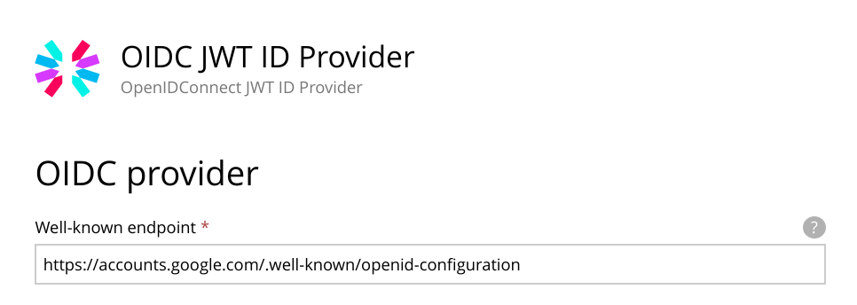

= Open ID Connect JWT ID Provider

Authenticate your users with JWT tokens issued by a OIDC provider.

This ID provider validates signatures of JWT tokens passed as Bearer tokens in the Authorization header of requests. It does this by calling the well-know endpoint of a OIDC provider to fetch public keys and those keys are then used to validate. It is compatible with all OIDC providers that provide a `jwks_uri` in their well-known configuration.

== Configuration

* In your Enonic XP admin interface
** In the admin tool "Applications", install the application "Open ID Connect JWT ID Provider" .
** In the admin tool "Users", create a ID provider and configure it to use the Open ID Connect JWT ID Provider.
*** Well-known endpoint: The URL to the well known endpoint of you OIDC provider
*** Allowed clients (audience): Optionally restrict allowed clients (audience claims).
*** Username claim: What claim to use for user names.
*** User display name claim: What claim to use for user display names.
*** User email claim: What claim to use for user email.

* In your Enonic Virtual Hosting configuration, modify the appropriate mappings so that webapp uses the user store you created.

    # Use JWT id provider for a web app
    mapping.mysite.host = example.com
    mapping.mysite.source = /
    mapping.mysite.target = /webapp/com.my.webapp
    mapping.mysite.idProvider.oidc = default

== How to enable debug logging

Add the following to $XP_HOME/config/logback.xml and restart the server

    <logger name="com.enonic.app.oidcjwtidprovider" additivity="false">
        <level value="DEBUG" />
        <appender-ref ref="STDOUT"/>
        <appender-ref ref="FILE"/>
    </logger>